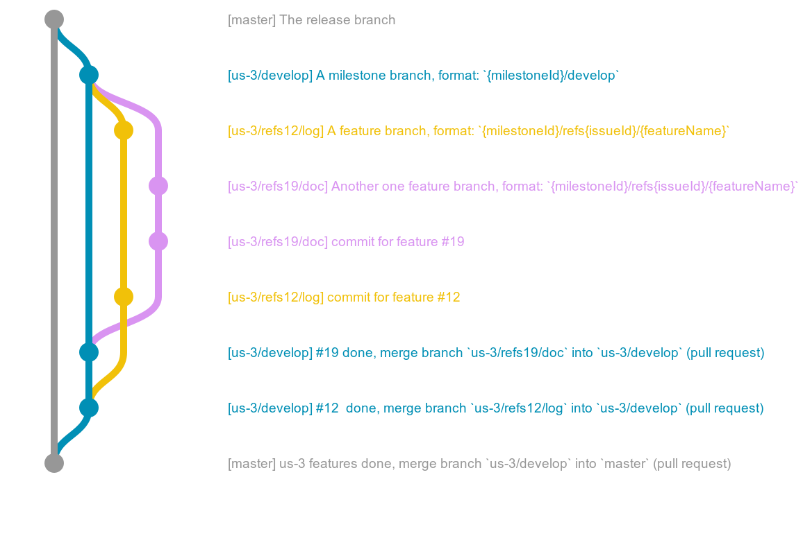
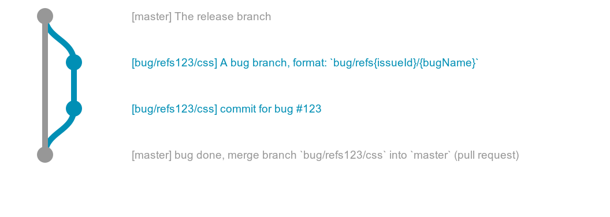

# Contributing

- [Git Commit Guidelines](#gcg)
- [Git Pull-Request Guidelines](#gprg)
- [Git Branch flow](#gbf)

## <a name="gcg"></a> Git Commit Guidelines

These guidelines are mostly inspired by the [`angular git commit guidelines`](https://github.com/angular/angular.js/blob/master/CONTRIBUTING.md).

### Commit Message Format
    
Each commit message consists of a header, a body and a footer.

```
<type>(<refs>): <subject>
<BLANK LINE>
<body>
<BLANK LINE>
<tags>
```

The header is mandatory. Any line of the commit message cannot be longer 100 characters! This allows the message to be easier to read on GitHub as well as in various git tools.

### Header

#### Type

`type` must be one of the following:

```
feat: A new feature
bug: A bug fix
doc: Documentation only changes
test: Adding missing or correcting existing tests
```

#### Refs

`refs` must be a `github` issue.

#### Subject

The `subject` contains succinct description of the change.

### Body

Just as in the subject, use the imperative, present tense: "change" not "changed" nor "changes".

### Footer

#### Tags

`tags` must be defined a set of tags, as for example:

```
Tags: tag1, tag2, tag3, ...
```

### Examples

```
feat(#123): Add something

- add 1
- add 2
- add 3

Tags: job, engine, stats
```

## <a name="gprg"></a> Git Pull-Request Guidelines

`pull-request` have almost the same model as commit guidelines.

```
merge(<refs>,<refs>,<refs>, ...): <subject>
<BLANK LINE>
<body>
<BLANK LINE>
<tags>
```

## <a name="gbf"></a> Git Branch flow

The branch flow is most be inspired by the [`git-flow`](http://nvie.com/posts/a-successful-git-branching-model/) model. 
However, `debme` is distributed in rolling release, ie no branch `develop` is present in the flux, which simplifies the model.

### Feature branch flow



### Bug branch flow


